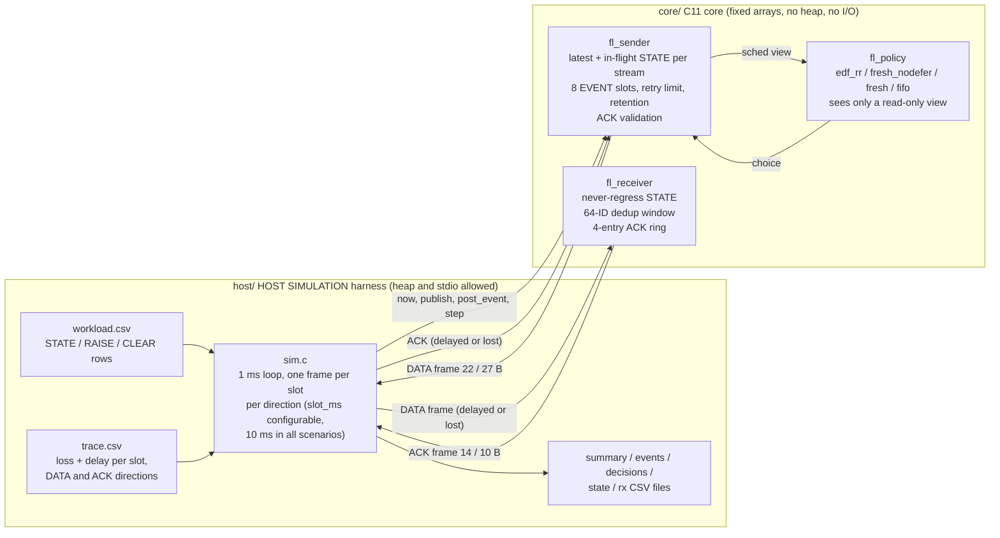
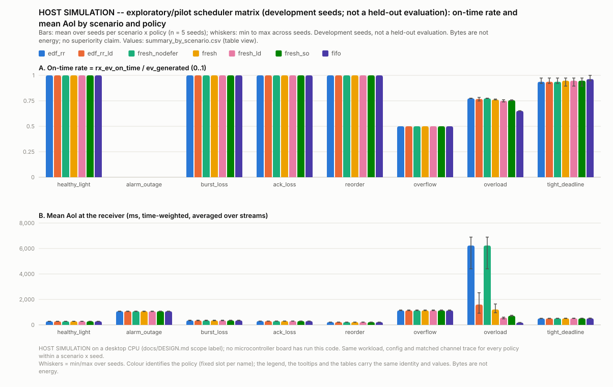

# Freshness Lab

A software-only research project on **telemetry with two different value
semantics**: replaceable **STATE** snapshots (only the newest matters) and
non-replaceable **EVENT** occurrences (every one matters), sent by one
fixed-memory C11 transmitter to one receiver over a lossy link. A
deterministic host harness replays scripted workloads against matched fault
traces so that scheduling policies, memory bounds and the modelled failure
modes can be inspected run by run.

**Scope.** Everything here runs on an ordinary desktop: no board, radio or
special hardware is required or was used. All measurements are host
simulations on five development seeds, labelled as such. The project
compares its own policies against its own baselines; it does not claim to
outperform any protocol or product, and no MCU timing, power or flash
figures exist.

**Navigation:** [Quick start](#quick-start) ·
[The alarm example](#why-two-semantics-the-alarm-example) ·
[Architecture](#architecture) · [Findings](#findings-host-simulation-pilot) ·
[Validation](#validation-evidence) · [Docs](#documentation-map) ·
[Reproducing](docs/REPRODUCING.md) · [Contributing](CONTRIBUTING.md)

## Quick start

Prerequisites: gcc or clang with C11, GNU make, Python 3 (standard library
only). Verified with gcc 13.3, clang 18.1, Python 3.11 on Ubuntu 24.04.

```sh
git clone -b claude/dazzling-galileo-0800h2 https://github.com/Padmaja777AI/freshness-lab.git
cd freshness-lab
make && make test            # build/flsim, six C test suites (4027 checks)
mkdir -p out/demo
python3 tools/gen_workload.py --scenario alarm_outage --seed 101 --out out/demo/workload.csv
python3 tools/gen_trace.py    --scenario alarm_outage --seed 101 --out out/demo/trace.csv
build/flsim --workload out/demo/workload.csv --trace out/demo/trace.csv \
            --config scenarios/alarm_outage.cfg --policy edf_rr --out out/demo/edf_rr
```

The last command prints one line:

```
HOST SIMULATION edf_rr: gen=2 adm=2 rej=0 acked=2 exh=0 exp=0 pend=0 | rx del=2 ontime=0 late=2 dup=0 oow=0 | aoi_mean_s0=1222.5 | bytes=4311 | interval_viol=0 core_err=0
```

and writes `out/demo/edf_rr/{summary,events,decisions,state,rx}.csv` (the
`out/` directory is git-ignored). Full instructions, the matrix run, the
counterexample reducer and troubleshooting: [docs/REPRODUCING.md](docs/REPRODUCING.md).

## Why two semantics: the alarm example

Scenario `alarm_outage` (seed 101, policy `edf_rr`): an alarm raises at
10.0 s and clears at 12.0 s while both link directions lose every frame from
9.0 s up to 15.0 s. The transmitter publishes the alarm flag as STATE stream 0
once a second and records each transition as an EVENT. Every row below is
taken from the retained `workload.csv`, `decisions.csv`, `rx.csv` and
`events.csv` of that run.

| Time | STATE stream 0 (`alarm_active`) | EVENT ledger |
|---:|---|---|
| 8.00 s | snapshot `0` (seq 9) generated and sent; **applied at 8.02 s** | |
| 10.00 s | snapshot `1` (seq 11) generated | RAISE #1 generated, deadline 11.00 s; attempt 1 sent, lost |
| 10.20–10.80 s | seq 11 sent three times, all lost | RAISE retried every 300 ms, lost |
| 11.00 s | snapshot `1` (seq 12) generated; sent 11.10–11.70 s, all lost | |
| 12.00 s | snapshot `0` (seq 13) generated; later sends lost | CLEAR #2 generated, deadline 13.00 s; attempt 1 sent, lost |
| 15.00 s | snapshot `0` (seq 16) generated | CLEAR #2 attempt 11 sent; **delivered 15.02 s** (2.02 s late) |
| 15.01 s | seq 16 sent; **applied at 15.03 s** | |
| 15.10 s | | RAISE #1 attempt 18 sent; **delivered 15.12 s** (4.12 s late) |

Between the snapshot generated at 8.00 s and the one generated at 15.00 s
the receiver applies nothing: it **never sees `1`**, so a latest-value-only
design has no record that the alarm fired. The event ledger delivers both
occurrences with their immutable IDs and generation times, both after their
deadlines (0 of 2 on time) and in reversed arrival order. What the ledger
gives you is history, not a reconstructed alarm state: an application that
applied the two events in arrival order would finish in the wrong state, so
ordering by generation time is its job.
Evidence: [`events.csv`](results/matrix/runs/alarm_outage/seed101/edf_rr/events.csv),
[`decisions.csv`](results/matrix/runs/alarm_outage/seed101/edf_rr/decisions.csv),
[`rx.csv`](results/matrix/runs/alarm_outage/seed101/edf_rr/rx.csv);
walkthrough in [docs/REPORT.md](docs/REPORT.md#3-the-demonstration-alarm-raised-and-cleared-inside-an-outage).

## Architecture



Selected properties, all grounded in `core/` and `host/`:

* **Fixed memory.** The persistent core contexts measure
  `sizeof(fl_sender_t)` = 888 B and `sizeof(fl_receiver_t)` = 296 B at the
  default capacities (8 streams, 8 event slots), as compiled with gcc on
  x86-64; these exclude stack frames and any transport buffers and are not
  MCU measurements. No heap on the processing path
  ([docs/MEMORY.md](docs/MEMORY.md)).
* **Explicit time.** The host passes `now` in milliseconds to every call;
  horizon 2^31 − 1 ms, no regress, relative durations bounded so `gen + rel`
  cannot wrap.
* **Exact accounting.** Every generated event ends in exactly one of
  `REJECTED_FULL`, `ACKED`, `RETRY_EXHAUSTED`, `RETENTION_EXPIRED` or
  `PENDING`; rejected events burn their ID so `generated = admitted + rejected`.
  Deadline (on-time check at the receiver, inclusive) is distinct from
  retention (how long the sender keeps trying); late delivery never counts
  as on time.
* **Honest knowledge.** An ACK proves past receipt under the declared rules,
  not the receiver's current state. Sender-side and receiver-side ledgers
  are kept independent and reported side by side.
* **Bounded dedup and reverse service.** A 64-ID window behind the highest
  delivered event; older IDs are refused and counted. ACKs go through a
  bounded queue served one frame per slot; overflow is counted.
* **Structural separation.** The policy module receives a read-only view
  built from the sender's own ledger and last-ACKed metadata; it cannot see
  the receiver, the channel trace or the future.
* **Matched traces.** Every policy in a scenario-and-seed cell is exposed
  to the same time-indexed channel conditions (loss and delay per slot and
  direction), so a policy's choices cannot alter the conditions it meets;
  which frames are actually lost still depends on when each policy
  transmits.

Policies: `edf_rr` (primary baseline: earliest-deadline events first, then
round-robin state), `fresh_nodefer` (ablation baseline with the candidate's
state ranking but no deferral), `fresh` (candidate: may defer an event with
slack to refresh stale state), `fresh_so`, `edf_rr_ld`, `fresh_ld`
(named variants), `fifo` (secondary). Normative definitions:
[docs/DESIGN.md](docs/DESIGN.md).

## Findings (HOST SIMULATION, pilot)

Means over 5 development seeds (not a held-out evaluation). "Eventual" counts
an event delivered at any time and "on time" only by its deadline, both over
**all generated events**, including rejected ones. Mean AoI is the
time-weighted age of the receiver's state snapshot, conditional on the
interval after each stream's first reception; read it with the unknown-time
column in [docs/RESULTS_SUMMARY.md](docs/RESULTS_SUMMARY.md#headline-numbers-means-over-5-pilot-seeds-denominator--all-generated-events).

| Scenario | Policy | Eventual receipt | On-time receipt | Mean AoI | What it shows | Evidence |
|---|---|---:|---:|---:|---|---|
| `healthy_light` | all 7 | 100 % | 100 % | ≈ 280 ms | near parity in these pilot runs | [table](results/matrix/summary.md) |
| `overload` | `edf_rr` | ≈ 78.2 % | ≈ 77.4 % | ≈ 6.2 s | state starves behind events | [table](results/matrix/summary.md) |
| `overload` | `fresh` | ≈ 77.0 % | ≈ 76.2 % | ≈ 1.2 s | ≈ 81 % lower mean age for ≈ 1.2 pp less receipt | [counterexample](results/reduce/overload_seed101_recall/walkthrough.md) |
| `overload` | `fifo` | ≈ 65.8 % | ≈ 65.1 % | ≈ 0.18 s | freshest state, most events lost | [table](results/matrix/summary.md) |
| `alarm_outage` | all 7 | 2/2 | 0/2 | ≈ 1.07 s | both late, arrival reversed, history kept | [ledger](results/matrix/runs/alarm_outage/seed101/edf_rr/events.csv) |
| `overflow` | all 7 | 28/40 | 20/40 | ≈ 1.14 s | 12 rejected at admission, IDs burned | [ledger](results/matrix/runs/overflow/seed101/edf_rr/events.csv) |



What the data supports: an **auditable trade-off** between event receipt and
state freshness under overload, with bounded memory and explicit failure
accounting. What it does not support: superiority over any policy or
protocol, hardware performance, or conclusions beyond five pilot seeds. Two
results to keep in view: the scenario built to make the candidate miss
deadlines (`tight_deadline`) did not, with overlapping seed ranges; and a
retry budget of 8 attempts × 300 ms exhausted retries inside a 6 s outage,
so the outage scenarios use 40 attempts for every policy
([`results/pilot/`](results/pilot/README.md)). Full analysis:
[docs/REPORT.md](docs/REPORT.md).

## Validation evidence

Separate from the experiments above, the implementation is checked by:

* **4027 C checks** in six suites (`tests/test_*.c`), passing natively and
  under AddressSanitizer + UndefinedBehaviorSanitizer, compiled with
  `-std=c11 -Werror` and strict warnings, plus a clang `-Weverything` pass.
  Expectations are hand-computed from the design, including the continuous-
  time AoI fixture (area 28, mean 2.8) and the lost-ACK ledger fixture
  (37 and 74 attempted bytes; 2 ms delivery vs 8 ms confirmation).
* **15 Python tests** for the generators, aggregation, reducer and plot
  (`tests/test_tools.py`).
* **320 runs** in the matrix (280 policy runs + 40 `fresh --defer 0`
  ablation runs) with **697 consistency assertions**, all passing: the
  accounting identity on every run, byte-identical ablation on all 40 cells,
  and the receiver's applied sequence inside the sender's
  `[last_acked, max_sent]` interval at every millisecond
  ([`results/matrix/checks.json`](results/matrix/checks.json)).
* **Clean reproduction:** a fresh checkout of source commit `f18d875`
  rebuilt, passed all of the above and regenerated the matrix with identical
  sha256 for all **1080 deterministic files**
  ([`results/reproduction_log.txt`](results/reproduction_log.txt),
  [`results/matrix/manifest.json`](results/matrix/manifest.json)).
* An adversarial code review with independent refutation; the two confirmed
  harness findings were fixed with regressions
  ([docs/REPORT.md §9](docs/REPORT.md#9-review-reconciliation)).

## Repository layout

```
core/        C11 core: fl_frame (codec), fl_policy, fl_sender, fl_receiver
host/        HOST SIMULATION harness: sim.c loop, csvio.c, aoi.c, flsim CLI
tests/       test_*.c (C suites), test_tools.py (Python), fltest.h
tools/       gen_workload.py, gen_trace.py, run_matrix.py, summarize.py,
             plot_svg.py, reduce_counterexample.py  (standard library only)
scenarios/   one key=value config per scenario, applied identically to all policies
results/     retained evidence: matrix/, reduce/, pilot/, reproduction_log.txt
docs/        DESIGN, RESULTS_SUMMARY, REPORT, REPRODUCING, MEMORY, RELATED_WORK
Makefile     all · test · sanitize · clang-check · tools-test · check · matrix · clean
```

## Documentation map

| Document | Read it for |
|---|---|
| [docs/RESULTS_SUMMARY.md](docs/RESULTS_SUMMARY.md) | two-page summary: question, scope, baselines, evidence, conclusions |
| [docs/REPORT.md](docs/REPORT.md) | full experiment report: walkthroughs, matrix tables, findings, review reconciliation, provenance |
| [docs/REPRODUCING.md](docs/REPRODUCING.md) | prerequisites, exact commands, expected outputs, hash comparison, troubleshooting |
| [docs/DESIGN.md](docs/DESIGN.md) | normative specification: time, identity, wire format, sender/receiver rules, policies, metrics, seed provenance |
| [docs/MEMORY.md](docs/MEMORY.md) | exact memory accounting of the core |
| [docs/RELATED_WORK.md](docs/RELATED_WORK.md) | MQTT, DDS, Micro XRCE-DDS, zbus, CoAP Observe, OPC UA, WiFresh, ACP+, AoII: what exists and how this differs |
| [CONTRIBUTING.md](CONTRIBUTING.md) | reproducing a bug, validating a behaviour change, preserving evidence, keeping claims accurate |

## Limitations and future work

Limitations of the evidence: host simulation only (MCU timing, power and
flash are unmeasured; hardware is outside the project's scope); five
development seeds, no held-out evaluation; a simple per-slot loss-and-delay
channel with no corruption or clock drift; sender knowledge limited to
last-ACKed metadata; loss accounting local to each end.

Future work, software-only and not implemented: an unseen-seed evaluation
after freezing the policies and configurations; workload and budget
sensitivity (event rate, deadline, retry budget, buffer capacity); stronger
adversarial fault combinations; a CRC trailer and corruption in the channel
model; receiver-visible loss notification.

## Attribution

The code, tests, tooling, experiments and documents in this repository were
written and executed by Claude Code (an AI coding tool) in this repository,
under human direction and review. Commits are authored by the tool with
`Co-Authored-By` trailers; the work is not represented as independently
hand-written code. Specifications and papers listed in
[docs/RELATED_WORK.md](docs/RELATED_WORK.md) were used as references only;
no code was copied from them. No license file has been added; licensing is
the repository owner's decision.
